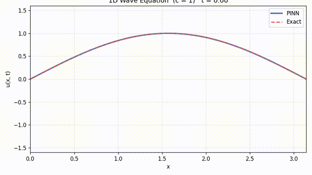

# 1D Wave Equation — PINN (PhysicsNeMo)

A Physics-Informed Neural Network, built with [NVIDIA PhysicsNeMo](https://developer.nvidia.com/physicsnemo) (`modulus.sym`), that solves the 1D wave equation

$$u_{tt} = c^2\, u_{xx}, \qquad x \in [0, \pi], \quad t \in [0, 2\pi], \quad c = 1$$

with

- **Initial conditions:** $u(x, 0) = \sin(x)$, $u_t(x, 0) = \sin(x)$
- **Boundary conditions:** $u(0, t) = u(\pi, t) = 0$

The analytical reference solution is $u(x, t) = \sin(x)\,\big(\cos(t) + \sin(t)\big)$.

## Result

The animation below compares the trained PINN prediction against the exact solution over one full period. Training converged to a final loss of ~$6\times10^{-7}$ after 10,000 steps.

A higher-quality MP4 version is available at [`wave_1D.mp4`](wave_1D.mp4).