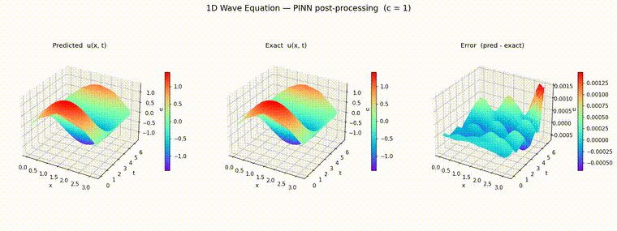

# 1D Wave Equation — PINN (PhysicsNeMo)

A Physics-Informed Neural Network, built with [NVIDIA PhysicsNeMo](https://developer.nvidia.com/physicsnemo) (`modulus.sym`), that solves the 1D wave equation

$$u_{tt} = c^2\, u_{xx}, \qquad x \in [0, \pi], \quad t \in [0, 2\pi], \quad c = 1$$

with

- **Initial conditions:** $u(x, 0) = \sin(x)$, $u_t(x, 0) = \sin(x)$
- **Boundary conditions:** $u(0, t) = u(\pi, t) = 0$

The analytical reference solution is $u(x, t) = \sin(x)\,\big(\cos(t) + \sin(t)\big)$.

## Result

Following the post-processing style of [`post_processing_1dwave_main.ipynb`](post_processing_1dwave_main.ipynb), the animation below shows rainbow `plot_trisurf` surfaces of the solution over the $(x, t)$ plane — the **predicted** $u(x, t)$, the **exact** solution, and their **error** — rotating so the full surfaces are visible. Training converged to a final loss of ~6×10⁻⁷ after 10,000 steps, and the pointwise error stays on the order of 10⁻³.

A higher-quality MP4 version is available at [`wave_1D_postproc.mp4`](wave_1D_postproc.mp4).